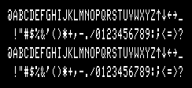
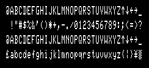
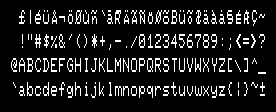

# Fonts

The TRS-80 Model I and III used a character generator (CG) chip to generate
the glyphs on the screen. The 2x3 graphical characters were not in the CG chip; these
were generated using discrete logic on the fly.

## Model I

The Model I used a MCM6670 CG chip, providing 5&times;7 pixels for each glyph.

It's helpful to think of the character set as being broken into
32-character banks. The Model I's CG chip had four banks
for the first 128 characters: symbols, digits, upper case, and
lower case. The lower case characters were especially bad,
with raised descenders and the letter "a" inexplicably raised two pixels:

Video was 1024 characters (16 rows of 64 columns), and the memory for this
was split across 1024-kilobit chips, one chip for each
data bit. To save money, Radio Shack omitted the chip
for bit 6, and its value was hard-wired to return the NOR of bits 5 and 7.
The resulting byte was used as the address for the CG chip.
This had the effect of duplicating bank 2 (digits) to bank 4, and
bank 3 (upper case) to bank 1:

 
The Level 1 Basic used the ASCII values, meaning bank 2 for digits
and bank 3 for upper case letters. Level 2 Basic, however, used
bank 1 for upper case letters. This made no difference since banks
1 and 3 looked the same.

The [Electric Pencil](https://en.wikipedia.org/wiki/Electric_Pencil)
word processor shipped with an unofficial modification to add
a bit 6 memory chip. This allowed the word processor to display
the lower case letters, but also caused the Level 2 Basic to display
the bank 1 symbols instead of upper case letters. A physical switch was
added to the keyboard to revert to the computed bit 6 value
when not running the word processor.

Radio Shack later sold an official 
[lower case modification kit](http://www.trs-80.org/radio-shack-lower-case-kit/) 
(26-1104). This not only
added the bit 6 RAM, but also replaced the CG chip to provide better
lower case letters. To be compatible with Level 2 Basic, bank 3 was duplicated to
bank 1. Note that the CG chip still didn't have space for true descenders, so they
raised all lower case non-descender letters up one pixel. Also the backquote
was replaced with a pound sign, and the tilde was replaced with a yen sign:

## Model III

The Model III's CG chip's glyphs were 7&times;8, allowing
lower case letters to sit on the same baseline as the upper case letters.
A nice set of Latin letters were placed in bank 1, and the backquote
and tilde were restored:

On the Model I, the entire high half of the character set were the
2x3 graphical characters. These only take up 64 slots, but the
bit 6 hack forced them to be duplicated (banks 5 and 6 were the
same as 7 and 8). On the Model III the graphics characters were
placed in banks 5 and 6, leaving another 64 free slots. By default
these had Greek, math, and drawing characters:  

Setting bit 3 of port 0xEC switched these to Katakana characters:

## References

Glen Kleinschmidt's [write-up of his Model I clone](http://www.glensstuff.com/trs80/docco/trs80model1clone.pdf)
has lots of great details about the video circuitry of the original.
His [posts in the EEVblog forums](https://www.eevblog.com/forum/projects/cloning-a-tandy-trs-80-model-1/) also have great info.

Matthew Reed wrote up the [Electic Pencil lower case modification](http://www.trs-80.org/electric-pencil-lowercase-modification/).

Rebecca G. Bettencourt has a wonderful set of [TRS-80 fonts](https://www.kreativekorp.com/software/fonts/trs80.shtml).

The fonts in this emulator were taken from the [xtrs](https://www.tim-mann.org/xtrs.html)
emulator.
